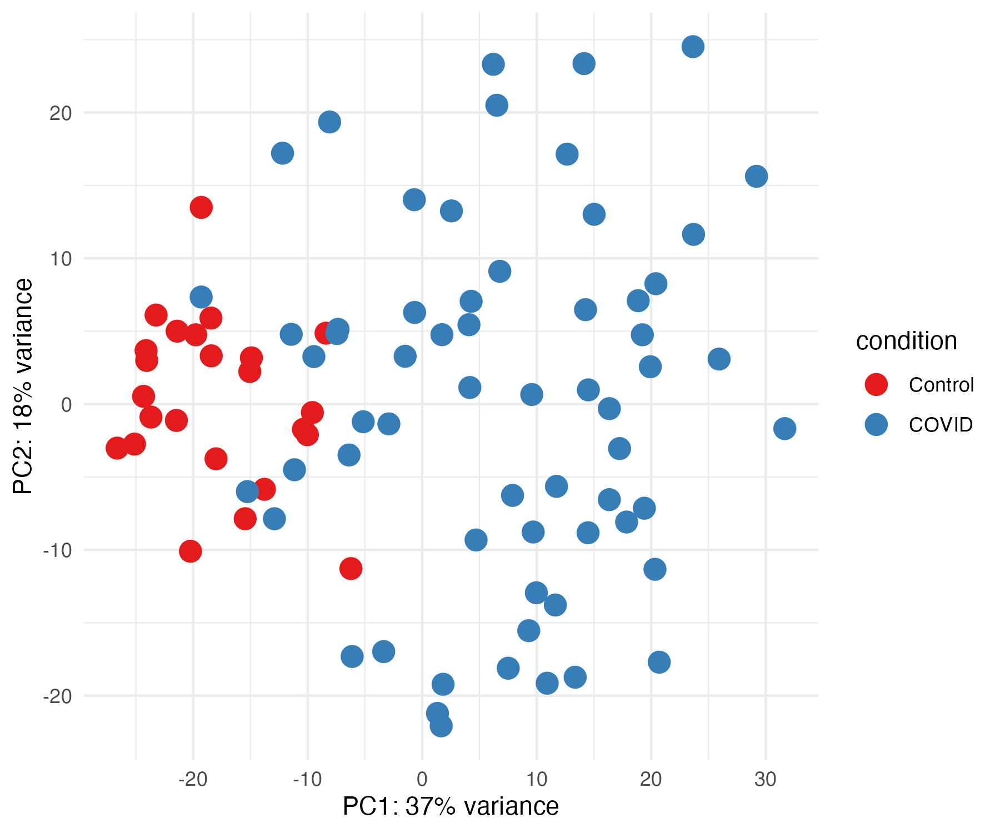
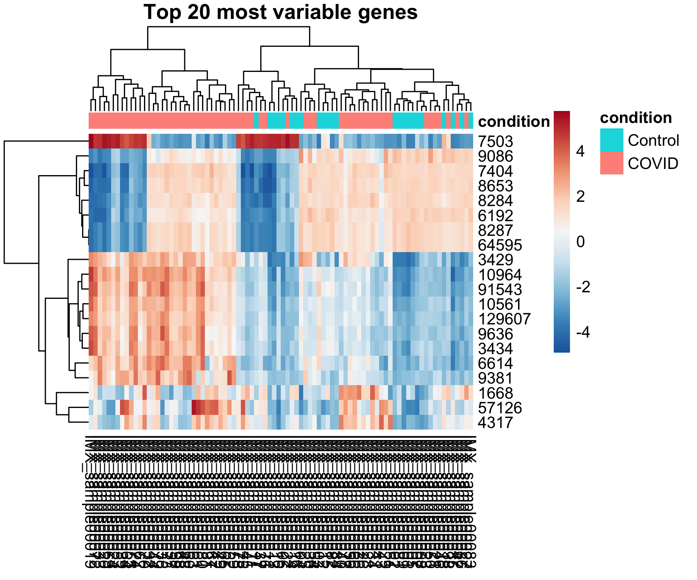
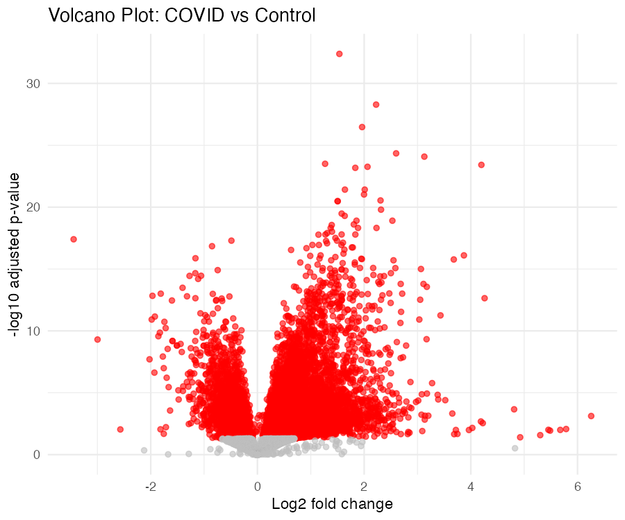

# RNA-seq Differential Expression Analysis (COVID-19 vs Controls)

This project reproduces a **differential gene expression analysis** using the **GSE152641** dataset (whole blood, COVID-19 patients vs healthy controls).  
The workflow is implemented in **R** with **DESeq2**, covering data download, quality control, PCA, heatmap, differential expression, and volcano plot.

---

## Project Structure
```text
scripts/      # RNAseq_workflow.R (main script)
results/      # dds_ready.rds, DE_results.csv
figures/      # PCA_plot.png, heatmap_top20.png, volcano_plot.png
data/         # downloaded GEO data (not versioned, see data/README.txt)
```
---

## Workflow
The workflow is fully reproducible via a single R script:

1. Download data from GEO (GSE152641)
2. Build metadata from GEO sample annotations
3. Create DESeq2 object
4. Variance Stabilizing Transformation (VST)
5. PCA of samples
6. Heatmap of top 20 most variable genes
7. Differential expression analysis (COVID vs Control)
8. Shrinkage of log2 Fold Change (apeglm)
9. Volcano plot

---

## How to Run
In **R/RStudio** (R ≥ 4.2):

```r
setwd("RNAseq_DE_project")
source("scripts/RNAseq_workflow.R")

The script will:
    
    Install missing CRAN/Bioconductor packages

Download GEO data (if not already present)

Generate results in results/ and figures in figures/
    
    Outputs

Figures/
    
  
  
  


Results/
    
    dds_ready.rds

DE_results.csv

Preview:
    
    
    
    
    
    
    Dataset

GEO Accession: GSE152641

Inflammatix COVID-19 whole blood RNA-seq dataset.

References

Love MI, Huber W, Anders S (2014). Moderated estimation of fold change and dispersion for RNA-seq data with DESeq2. Genome Biology.

GEO Accession: GSE152641, NCBI GEO.

License

MIT License (for code).
Data licensing and usage should follow the conditions of NCBI GEO.

